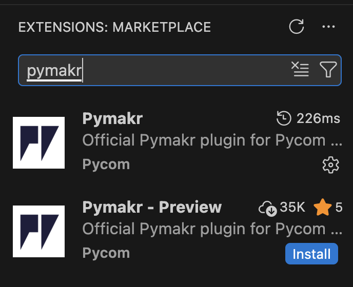
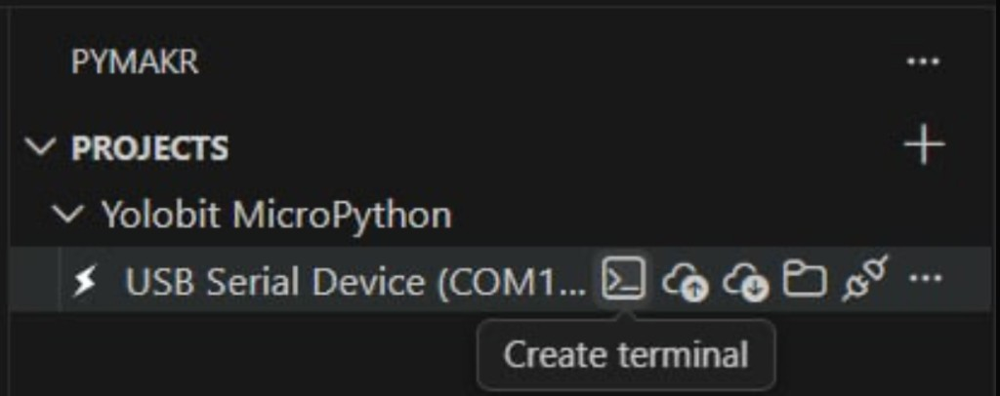
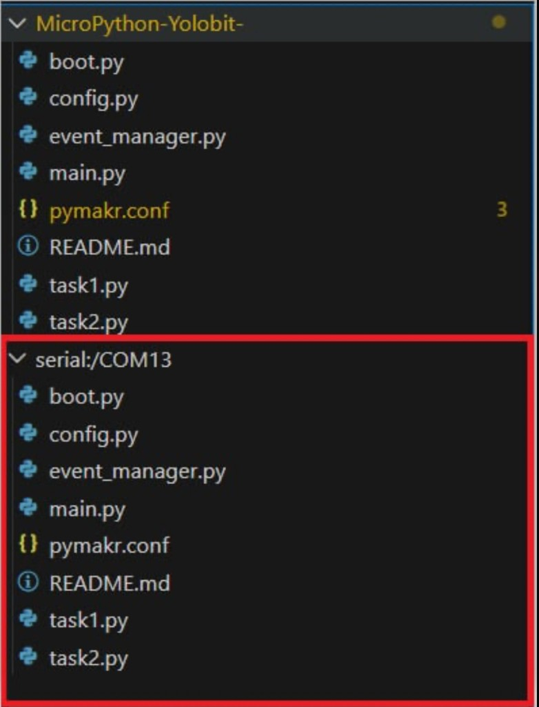

## Yolobit MicroPython (OhStem) – Template theo event_manager

Template này giúp bạn lập trình **Yolo:Bit (OhStem)** bằng **MicroPython** trên **VSCode** và nạp chương trình bằng extension **PyMakr**.

- **Kiến trúc giống OhStem kéo thả**: dùng `event_manager.reset()`, `event_manager.add_timer_event(...)`, vòng lặp `event_manager.run()` + `time.sleep_ms(10)`.
- **Mỗi task một file**: `task1.py`, `task2.py`, ...; mỗi file có **2 hàm**:
  - `task_init()` chạy **1 lần**
  - `task_run()` chạy **lặp theo chu kỳ** (được add vào event_manager)
- **Biến trạng thái** (ví dụ `status`) khai báo **toàn cục trong từng file task**.

## Yêu cầu

- **Phần cứng**: Yolo:Bit (OhStem) + cáp USB type C.
- **Firmware**: MicroPython cho Yolo:Bit.
- **VSCode**: cài extension **PyMakr** (Pycom).
- **Driver USB**:
  - Windows: cần driver CH340/CP210x tùy board.
  - macOS: thường dùng được ngay; nếu không thấy cổng USB-Serial thì cần cài driver theo OhStem.

## Cấu trúc project (những file quan trọng)

```
yolobit-micropython/
├── main.py          # chương trình chính: reset, task_init, add_timer_event, while True run()
├── event_manager.py # (kèm theo) polyfill nếu firmware thiếu event_manager
├── config.py        # chu kỳ task: INTERVAL_TASK1_MS, INTERVAL_TASK2_MS, ...
├── task1.py         # task 1: task_init(), task_run(), status toàn cục
├── task2.py         # task 2: chớp Image.HEART / Image.HEART_SMALL (giống block OhStem)
├── pymakr.conf      # cấu hình PyMakr (tùy chọn)
├── lib/             # Thư viện OhStem: MQTT, NTP, Sự kiện, AIOT KIT (xem lib/README.md)
├── images/          # ảnh minh họa cho README (extension, device explorer, terminal)
└── README.md
```

## Hướng dẫn A → Z: nạp code bằng PyMakr trên VSCode

### A. Cài đặt PyMakr

**⚠️ Lưu ý quan trọng — tránh cài nhầm extension:**

- Trong Marketplace có **hai** extension tên gần giống nhau:
  - **Pymakr** (bản ổn định) — **dùng cái này**.
  - **Pymakr - Preview** — **không cài** bản Preview cho bài này.
- Cách chọn đúng: tìm **"Pymakr"** của **Pycom**, mô tả "Official Pymakr plugin for Pycom...". Nếu thấy hai mục thì chọn mục **không** có chữ **"Preview"** trong tên.
- Sau khi cài, trong Extensions bên trái sẽ hiện **Pymakr** (có biểu tượng bánh răng/cấu hình), **không** hiện "Pymakr - Preview".
- **Nếu đã cài nhầm "Pymakr - Preview"**: vào Extensions → tìm "Pymakr - Preview" → **Uninstall**, sau đó cài lại đúng **Pymakr** (không có chữ Preview).



**Các bước:**

1. Mở VSCode → **Extensions** (Ctrl+Shift+X / Cmd+Shift+X) → ô tìm kiếm gõ **pymakr**.
2. Cài extension **Pymakr** của **Pycom** (không phải "Pymakr - Preview").
3. Cắm Yolo:Bit vào máy tính bằng **cáp USB**.
4. Kiểm tra máy có thấy cổng serial USB:
   - Windows: Device Manager → Ports (COM & LPT) → thấy `COMx`.
   - macOS: sẽ có `/dev/cu.*` (thường là `/dev/cu.usbserial-*` hoặc `/dev/cu.SLAB_USBtoUART`).

### B. Mở đúng project trong VSCode

1. VSCode → **File → Open Folder…**
2. Chọn thư mục `yolobit-micropython` (thư mục chứa `main.py`, `pymakr.conf`, …).

Lưu ý:
- **Đừng tạo “New project” trong PyMakr** cho trường hợp này. Project của bạn chính là folder đang mở trong VSCode.

### C. Cấu hình `pymakr.conf` (khuyến nghị)

Mở file `pymakr.conf`. Bạn có thể để `address` trống và chọn cổng khi Add device, hoặc điền sẵn.

Ví dụ (Windows):

```json
{
  "name": "Yolobit MicroPython",
  "address": "COM13",
  "sync_folder": "",
  "sync_file_types": "py,txt,log,json",
  "ctrl_c_on_connect": true,
  "safe_boot_on_upload": false
}
```

Ví dụ (macOS):

```json
{
  "name": "Yolobit MicroPython",
  "address": "/dev/cu.usbserial-0001",
  "sync_folder": "",
  "sync_file_types": "py,txt,log,json",
  "ctrl_c_on_connect": true,
  "safe_boot_on_upload": false
}
```

Giải thích nhanh:
- **name**: tên project hiển thị trong PyMakr.
- **address**: cổng serial (COMx hoặc `/dev/cu.*`).
- **sync_folder**: để rỗng = sync **toàn bộ** project folder.
- **ctrl_c_on_connect**: tự gửi Ctrl+C khi connect để dừng script đang chạy (giúp upload ổn định).
- **safe_boot_on_upload**: thường để `false`; khi upload bị lỗi do script đang chạy, bạn có thể thử bật `true` (tùy firmware).

### D. Add device → Connect device

Trong panel PyMakr (bên trái):

1. Vào **PROJECTS** → chọn project (ví dụ “Yolobit MicroPython”).
2. Nhấn **Add device**.
3. Chọn đúng **COM/USB Serial** của Yolo:Bit.
   - Không chọn các cổng Bluetooth (ví dụ `tty.RedmiBuds...`, `Bluetooth-Incoming-Port`).
4. Nhấn **Connect device**.

### E. Sync project to device (Upload)

1. Khi đã connect, nhấn **Sync project to device** (hoặc “Upload project to device”).
2. Chờ sync xong.

### F. Mở Serial Terminal/REPL để xem `print()` và debug

Để xem dòng chữ in ra từ board (ví dụ "Xin chào!"), bạn cần mở **Serial Terminal** (REPL) của PyMakr:

1. Trong **panel PyMakr** (bên trái), sau khi đã **Connect device**, nhấn vào icon **Create terminal** (hộp nhỏ có mũi tên phải, tooltip hiện "Create terminal"). Đây chính là Serial/REPL — mọi `print()` từ board sẽ hiện ở đây.



2. Trong cửa sổ Terminal vừa mở, bạn có thể kiểm tra file đã lên board chưa:

```python
import os
os.listdir()
```

Danh sách phải có (tối thiểu):
- `main.py`
- `config.py`
- `task1.py`
- `task2.py`
- `event_manager.py` (nếu firmware không có module này)

### G. “Open device in file explorer” — xem và sửa file trên thiết bị

Sau khi sync, bạn có thể **xem và sửa trực tiếp** file trên Yolo:Bit:

1. Trong PyMakr, nhấn **Open device in file explorer** (icon thư mục có tia chớp).
2. Trong File Explorer (hoặc panel tương tự) sẽ xuất hiện **hai phần**:
   - **Trên**: thư mục project **trên máy** (ví dụ MicroPython-Yolobit-...).
   - **Dưới**: **serial:/COMxx** (hoặc `/dev/cu.xxx`) — đây chính là **filesystem trên thiết bị**. Các file bạn sync lên (main.py, task1.py, ...) sẽ hiển thị ở đây.
3. Bạn có thể **mở và chỉnh sửa** file ngay trong cây serial:/COMxx; lưu lại sẽ ghi thẳng lên board (hữu ích khi chỉ sửa nhanh trên device mà không cần sync lại cả project).



### H. Chạy chương trình

Có 2 cách:

- **Cách 1 (khuyến nghị)**: **Soft reset** để board chạy lại và vẫn giữ REPL ổn định.
  - Trong PyMakr chọn **Soft reset device** (hoặc trong REPL nhấn Ctrl+D).
  - Board sẽ tự chạy `main.py` → bạn thấy `print(...)` hiện ra trong Terminal.

- **Cách 2**: chạy trực tiếp từ REPL:

```python
import main
```

Lưu ý: Nếu `main.py` chạy vòng lặp vô hạn, REPL sẽ “bận”. Muốn dừng, gửi **Ctrl+C** hoặc dùng nút **Stop script** trong PyMakr.

### I. Hard reset / Reset vì sao hay bị disconnect?

- **Hard reset** là reset phần cứng → cổng COM/USB-Serial thường **tụt** rồi **lên lại** vài giây, nên PyMakr có thể bị **disconnect**.
- Đây thường **không phải lỗi code**. Nếu mục tiêu là “restart và xem log”, hãy dùng **Soft reset**.

### J. Sau khi rút USB, chương trình có chạy không?

- Nếu board **mất nguồn** khi rút USB → sẽ tắt, không chạy. Nhưng **code vẫn lưu** trên board.
- Nếu board được cấp nguồn bằng pin/nguồn ngoài → chương trình vẫn chạy.
- Mỗi lần bật nguồn/reset, MicroPython tự chạy `boot.py` rồi `main.py`.

## Thư viện mở rộng (lib) – MQTT, NTP, Sự kiện, AIOT KIT

Trên app.ohstem.vn, trong **Mở rộng** có các thư viện như **AIOT KIT**, **Sự kiện**, **MQTT**, **NTP**. Project này đã kèm sẵn các thư viện tương ứng trong thư mục **`lib/`** để dùng khi lập trình Python trên VSCode.

**Lưu ý:** Khi **Sync project to device**, cần đồng bộ cả thư mục **`lib`** lên board. Chi tiết đầy đủ và ví dụ xem **`lib/README.md`**.

---

### 1. MQTT (WiFi + broker MQTT)

**Nguồn OhStem:** [AITT-VN/yolobit_extension_mqtt](https://github.com/AITT-VN/yolobit_extension_mqtt)

**Import:** `from lib.mqtt import mqtt`

| Hàm / thuộc tính | Mô tả |
|------------------|--------|
| `mqtt.connect_wifi(ssid, password, wait_for_connected=True)` | Kết nối WiFi. `wait_for_connected`: chờ tới khi kết nối xong (mặc định True). |
| `mqtt.wifi_connected()` | Trả về `True`/`False` — WiFi đã kết nối chưa. |
| `mqtt.connect_broker(server='mqtt.ohstem.vn', port=1883, username='', password='')` | Kết nối broker MQTT. Mặc định server OhStem. Với `mqtt.ohstem.vn` hoặc `io.adafruit.com`, topic sẽ có prefix `username/feeds/`. |
| `mqtt.publish(topic, message)` | Gửi tin nhắn lên topic. Có giới hạn tối thiểu 1 giây giữa hai lần gửi. |
| `mqtt.on_receive_message(topic, callback)` | Đăng ký callback khi nhận tin trên topic. `callback(msg)` nhận chuỗi `msg`. |
| `mqtt.check_message()` | Kiểm tra tin đến (gọi trong vòng lặp chính). Tự reconnect WiFi nếu mất kết nối. |

**Ví dụ:**

```python
from lib.mqtt import mqtt
mqtt.connect_wifi('TenWiFi', 'MatKhau')
mqtt.connect_broker(server='mqtt.ohstem.vn', port=1883, username='user', password='')
mqtt.publish('V1', 'Hello')
def on_msg(msg):
    print('Nhan:', msg)
mqtt.on_receive_message('V2', on_msg)
# Trong vòng lặp: mqtt.check_message()
```

---

### 2. NTP – Lấy thời gian theo internet

**Nguồn OhStem (block NTP):** [AITT-VN/yolobit_ntp](https://github.com/AITT-VN/yolobit_ntp)  
*(Trong repo là block; project dùng `lib/ntp_helper.py` gọi `ntptime` + `machine.RTC` tương thích block.)*

**Import:** `from lib.ntp_helper import set_time_from_ntp, get_time, get_time_str`

| Hàm | Mô tả |
|-----|--------|
| `set_time_from_ntp(gmt_offset=7)` | Đồng bộ giờ từ NTP, áp múi giờ. `gmt_offset`: +7 (VN), +8, -5, ... Gọi **sau khi đã kết nối WiFi**. Trả về `True`/`False`. |
| `get_time()` | Trả về `(year, month, day, hour, minute, second)` từ RTC. |
| `get_time_str()` | Trả về chuỗi dạng `"YYYY-MM-DD HH:MM:SS"`. |

**Ví dụ:**

```python
from lib.mqtt import mqtt
from lib.ntp_helper import set_time_from_ntp, get_time, get_time_str
mqtt.connect_wifi('TenWiFi', 'MatKhau')
set_time_from_ntp(7)  # GMT+7 Việt Nam
print(get_time_str())  # "2025-02-27 10:30:00"
y, mo, d, h, mi, s = get_time()
```

---

### 3. Sự kiện (event_manager đầy đủ)

**Nguồn OhStem:** [AITT-VN/yolobit_extension_events](https://github.com/AITT-VN/yolobit_extension_events)

**Import:** `from lib.event_manager_ohstem import event_manager`

| Hàm | Mô tả |
|-----|--------|
| `event_manager.reset()` | Xóa toàn bộ sự kiện đã đăng ký. |
| `event_manager.add_timer_event(interval, callback)` | Thêm sự kiện định thời. `interval`: chu kỳ (ms). `callback`: hàm không tham số, gọi mỗi `interval` ms. |
| `event_manager.add_message_event(message_index, callback)` | Thêm sự kiện theo “message”. Khi gọi `broadcast_message(message_index)` thì `callback()` được gọi. |
| `event_manager.add_condition_event(condition, callback)` | Thêm sự kiện theo điều kiện. `condition`: hàm không tham số, trả về True/False. Khi True thì gọi `callback()` (có thể chạy trong thread). |
| `event_manager.broadcast_message(message_index)` | Kích hoạt tất cả callback đã đăng ký với `message_index`. |
| `event_manager.run()` | Chạy kiểm tra timer/condition và gọi callback tương ứng. Gọi **trong vòng lặp chính** (ví dụ `while True: event_manager.run(); time.sleep_ms(10)`). |

**Ví dụ:**

```python
from lib.event_manager_ohstem import event_manager
import time
event_manager.reset()
def on_timer():
    print('timer')
event_manager.add_timer_event(1000, on_timer)
def on_msg():
    print('message 0')
event_manager.add_message_event(0, on_msg)
event_manager.broadcast_message(0)  # gọi on_msg
while True:
    event_manager.run()
    time.sleep_ms(10)
```

---

### 4. AIOT KIT (DHT20, LED RGB, …)

**Nguồn OhStem:** [AITT-VN/yolobit_extension_aiot](https://github.com/AITT-VN/yolobit_extension_aiot)

Cần Yolo:Bit có **yolobit** (pin19, pin20, …) và mạch mở rộng tương thích.

#### 4.1. DHT20 – Cảm biến nhiệt độ, độ ẩm

**Import:** `from lib.aiot.aiot_dht20 import DHT20`

| Hàm | Mô tả |
|-----|--------|
| `DHT20()` | Khởi tạo, I2C qua pin19 (SCL), pin20 (SDA). |
| `dht.read_dht20()` | Đọc dữ liệu thô (list 7 byte). |
| `dht.dht20_temperature()` | Trả về nhiệt độ (°C, float 1 chữ số thập phân). |
| `dht.dht20_humidity()` | Trả về độ ẩm (%, float 1 chữ số thập phân). |

**Ví dụ:**

```python
from lib.aiot.aiot_dht20 import DHT20
dht = DHT20()
print(dht.dht20_temperature(), dht.dht20_humidity())
```

#### 4.2. RGBLed – LED RGB (NeoPixel)

**Import:** `from lib.aiot.aiot_rgbled import RGBLed`

| Hàm | Mô tả |
|-----|--------|
| `RGBLed(pin, num_leds)` | Khởi tạo. `pin`: số chân GPIO. `num_leds`: số LED (ví dụ 4). |
| `rgb.show(index, color, delay=None)` | Hiển thị màu. `index`: 0 = tất cả, 1..num_leds = từng LED. `color`: tuple `(r, g, b)` (0–255). `delay`: nếu có, sau đó tắt (0,0,0). |
| `rgb.off(index)` | Tắt LED: `index` 0 = tất cả, 1..num_leds = từng LED. |

**Ví dụ:**

```python
from lib.aiot.aiot_rgbled import RGBLed
rgb = RGBLed(pin14.pin, 4)  # pin14 từ yolobit, 4 LED
rgb.show(1, (255, 0, 0))    # LED 1 đỏ
rgb.show(0, (0, 255, 0))    # tất cả xanh lá
rgb.off(0)
```

---

### Link nguồn thư viện OhStem (GitHub AITT-VN)

| Thư viện | Repository |
|----------|------------|
| MQTT | https://github.com/AITT-VN/yolobit_extension_mqtt |
| Sự kiện | https://github.com/AITT-VN/yolobit_extension_events |
| NTP (block) | https://github.com/AITT-VN/yolobit_ntp |
| AIOT KIT | https://github.com/AITT-VN/yolobit_extension_aiot |

Tổ chức OhStem (AITT-VN): https://github.com/AITT-VN

## Các chức năng PyMakr hay dùng (tóm tắt)

- **Add device**: thêm thiết bị theo cổng COM.
- **Connect device / Disconnect device**: kết nối / ngắt kết nối.
- **Sync project to device (Upload)**: upload toàn bộ project lên board.
- **Download project from device**: tải file từ board về máy.
- **Open device in file explorer**: xem filesystem trên board.
- **Open Terminal/REPL**: mở console để chạy lệnh, xem `print()`.
- **Stop script**: gửi Ctrl+C để dừng chương trình đang chạy.
- **Soft reset device**: reset “mềm”, thường giữ kết nối tốt hơn.
- **Hard reset device**: reset “cứng”, có thể làm rớt COM tạm thời.

## Nội dung chương trình mẫu

### Task 1: `task1.py`

- In `Xin chào!` mỗi 1 giây.

### Task 2: `task2.py`

- Chớp qua lại `Image.HEART` và `Image.HEART_SMALL` (giống block OhStem).

Chu kỳ nằm trong `config.py`:
- `INTERVAL_TASK1_MS = 1000`
- `INTERVAL_TASK2_MS = 500`

## Thêm task mới

1. Tạo `task3.py` có `status`, `task_init()`, `task_run()`.
2. Thêm `INTERVAL_TASK3_MS` trong `config.py`.
3. Trong `main.py`:
   - `import task3`
   - `task3.task_init()`
   - `event_manager.add_timer_event(config.INTERVAL_TASK3_MS, task3.task_run)`

## Gỡ lỗi nhanh

- `ImportError: no module named 'yolobit'` → firmware không đúng Yolo:Bit/OhStem.
- `ImportError: no module named 'event_manager'` → firmware thiếu; project này đã kèm **`event_manager.py`**. Đảm bảo bạn đã **sync/upload** file đó lên board.
- Không thấy log `print()`:
  - mở đúng **Terminal/REPL** của PyMakr,
  - dùng **Soft reset** thay vì Hard reset,
  - hoặc chạy `import main` trong REPL.

## Tài liệu tham khảo

- [OhStem Education](https://docs.ohstem.vn/)
- App lập trình: [app.ohstem.vn](https://app.ohstem.vn/) (kéo thả / MicroPython)
- **Nguồn thư viện (GitHub AITT-VN):** MQTT, Sự kiện, NTP, AIOT KIT — xem mục [Thư viện mở rộng (lib)](#thư-viện-mở-rộng-lib--mqtt-ntp-sự-kiện-aiot-kit) và bảng link ở cuối mục đó.
